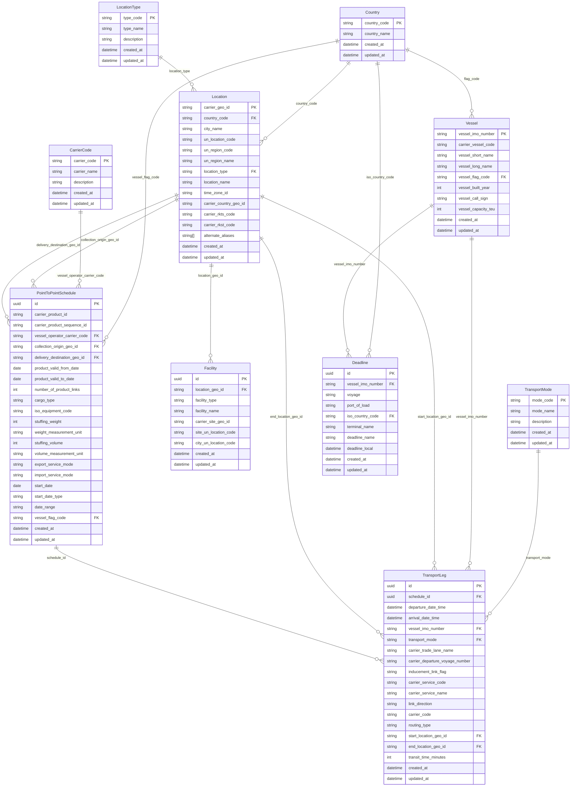

# 🚢 Maersk API Data Model - Entity Relationship Diagram

## 📊 ERD Diagram



## 📋 Table Descriptions

### 🔗 Reference Tables

#### **Country**
- **Purpose**: ISO 3166-1 country codes and names
- **Key Fields**: `country_code` (PK), `country_name`
- **Usage**: Referenced by vessels, locations, schedules, and deadlines
- **Sample Data**: US, CN, DE, NL, SG, HK, JP, KR, GB, FR, etc.

#### **CarrierCode**
- **Purpose**: NMFTA SCAC codes for Maersk carriers
- **Key Fields**: `carrier_code` (PK), `carrier_name`, `description`
- **Usage**: Referenced by point-to-point schedules
- **Sample Data**: MAEU, SEAU, SEJJ, MCPU, MAEI

#### **TransportMode**
- **Purpose**: Transportation modes for transport legs
- **Key Fields**: `mode_code` (PK), `mode_name`, `description`
- **Usage**: Referenced by transport legs
- **Sample Data**: MVS, FEF, FEO, BAR, TRK, RR, VSF, VSL, VSM

#### **LocationType**
- **Purpose**: Types of locations (cities, terminals, etc.)
- **Key Fields**: `type_code` (PK), `type_name`, `description`
- **Usage**: Referenced by locations
- **Sample Data**: CITY, COUNTRY, TERMINAL, BARGE_TERMINAL, RAIL_TERMINAL, CONTAINER_FREIGHT_ST, CUSTOMER_LOCATION, DEPOT

### 🚢 Main Tables

#### **Vessel**
- **Purpose**: Vessel information from Maersk fleet
- **Key Fields**: `vessel_imo_number` (PK), `carrier_vessel_code`, `vessel_long_name`
- **Relations**: Country (flag), TransportLeg, Deadline
- **API Source**: Vessels API

#### **Location**
- **Purpose**: Geographic locations (cities, ports, terminals)
- **Key Fields**: `carrier_geo_id` (PK), `country_code`, `city_name`, `un_location_code`
- **Relations**: Country, LocationType, Facility, PointToPointSchedule, TransportLeg
- **API Source**: Locations API

#### **Facility**
- **Purpose**: Specific facilities within locations (terminals, depots)
- **Key Fields**: `id` (PK), `location_geo_id`, `facility_type`, `facility_name`
- **Relations**: Location
- **API Source**: P2P API (facilities object)

#### **PointToPointSchedule**
- **Purpose**: Ocean product schedules with origin/destination
- **Key Fields**: `id` (PK), `carrier_product_id`, `collection_origin_geo_id`, `delivery_destination_geo_id`
- **Relations**: CarrierCode, Location (origin/destination), Country (flag), TransportLeg
- **API Source**: P2P API

#### **TransportLeg**
- **Purpose**: Individual transport segments within schedules
- **Key Fields**: `id` (PK), `schedule_id`, `vessel_imo_number`, `transport_mode`
- **Relations**: PointToPointSchedule, Vessel, TransportMode, Location (start/end)
- **API Source**: P2P API (transportLegs array)

#### **Deadline**
- **Purpose**: Vessel/voyage deadlines for specific ports
- **Key Fields**: `id` (PK), `vessel_imo_number`, `voyage`, `port_of_load`
- **Relations**: Vessel, Country
- **API Source**: Deadlines API

## 🔑 Key Design Decisions

### 1. **Normalization Strategy**
- **Reference Tables**: Countries, carrier codes, transport modes, location types
- **Main Tables**: Vessels, locations, facilities, schedules, transport legs, deadlines
- **Benefits**: Data consistency, reduced redundancy, easier maintenance

### 2. **Performance Optimization**
- **Indexes**: Created on frequently queried fields
- **Composite Indexes**: For date ranges and location combinations
- **Foreign Key Indexes**: Automatic indexes on all foreign keys

### 3. **Data Integrity**
- **Foreign Key Constraints**: All relationships properly defined
- **Cascade Deletes**: Transport legs cascade when schedules are deleted
- **Default Values**: Sensible defaults for cargo types, equipment codes, etc.

### 4. **API Alignment**
- **Field Mapping**: Direct mapping from API response fields
- **Data Types**: Preserved original data types and constraints
- **Optional Fields**: All optional API fields marked as nullable

## 📊 Sample Queries

### 1. **Find all vessels with their flag countries**
```sql
SELECT 
    v.vessel_long_name,
    v.vessel_capacity_teu,
    c.country_name as flag_country
FROM vessels v
JOIN countries c ON v.vessel_flag_code = c.country_code
ORDER BY v.vessel_capacity_teu DESC;
```

### 2. **Get point-to-point schedules with origin/destination details**
```sql
SELECT 
    p.carrier_product_id,
    cc.carrier_name,
    origin.city_name as origin_city,
    origin.country_code as origin_country,
    dest.city_name as destination_city,
    dest.country_code as destination_country,
    p.number_of_product_links
FROM point_to_point_schedules p
JOIN carrier_codes cc ON p.vessel_operator_carrier_code = cc.carrier_code
JOIN locations origin ON p.collection_origin_geo_id = origin.carrier_geo_id
JOIN locations dest ON p.delivery_destination_geo_id = dest.carrier_geo_id
WHERE p.product_valid_from_date >= CURRENT_DATE;
```

### 3. **Find transport legs for a specific vessel**
```sql
SELECT 
    tl.departure_date_time,
    tl.arrival_date_time,
    tm.mode_name as transport_mode,
    start_loc.city_name as start_city,
    end_loc.city_name as end_city,
    v.vessel_long_name
FROM transport_legs tl
JOIN vessels v ON tl.vessel_imo_number = v.vessel_imo_number
JOIN transport_modes tm ON tl.transport_mode = tm.mode_code
JOIN locations start_loc ON tl.start_location_geo_id = start_loc.carrier_geo_id
JOIN locations end_loc ON tl.end_location_geo_id = end_loc.carrier_geo_id
WHERE v.vessel_imo_number = '9456783'
ORDER BY tl.departure_date_time;
```

### 4. **Get deadlines for a specific vessel/voyage**
```sql
SELECT 
    d.deadline_name,
    d.deadline_local,
    d.terminal_name,
    d.port_of_load,
    c.country_name
FROM deadlines d
JOIN countries c ON d.iso_country_code = c.country_code
WHERE d.vessel_imo_number = '9456783' 
  AND d.voyage = '216E'
ORDER BY d.deadline_local;
```

## 🔒 Security & Access Control

### **Row Level Security (RLS)**
- **Authenticated Users**: Read-only access to all tables
- **Service Role**: Full access for API operations
- **Policies**: Based on user roles and authentication status

### **Data Protection**
- **Sensitive Data**: No sensitive information stored
- **Audit Trail**: `created_at` and `updated_at` timestamps on all tables
- **Access Logging**: Supabase provides built-in access logging

## 📈 Migration Notes

### **Version History**
- **v1.0**: Initial schema based on Maersk API contracts
- **v1.1**: Added missing fields from API specifications
- **v1.2**: Enhanced relationships and constraints
- **v1.3**: Added performance indexes and RLS policies

### **Future Enhancements**
- **Partitioning**: Consider partitioning large tables by date
- **Materialized Views**: For complex aggregations
- **Full-Text Search**: For location and vessel name searches
- **Caching**: Redis integration for frequently accessed data

## 🚀 Usage Guidelines

### **Best Practices**
1. **Use Foreign Keys**: Always use foreign key relationships for data integrity
2. **Index Queries**: Ensure queries use indexed fields for performance
3. **Batch Operations**: Use batch inserts/updates for large datasets
4. **Connection Pooling**: Use connection pooling for production applications

### **API Integration**
1. **Data Sync**: Regular sync from Maersk APIs to keep data current
2. **Error Handling**: Implement proper error handling for API failures
3. **Rate Limiting**: Respect API rate limits and implement backoff strategies
4. **Data Validation**: Validate data before insertion

### **Monitoring**
1. **Query Performance**: Monitor slow queries and optimize indexes
2. **Data Quality**: Regular checks for data consistency and completeness
3. **API Health**: Monitor API availability and response times
4. **Storage Usage**: Track database growth and plan for scaling
