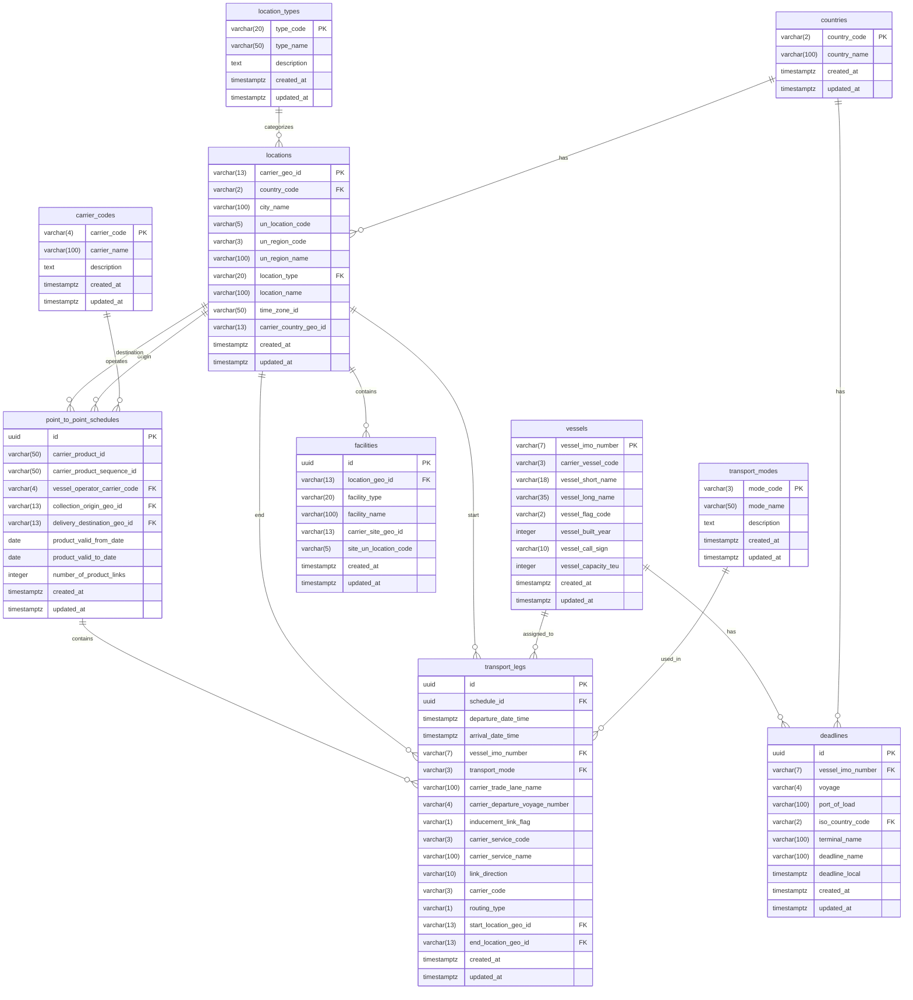

# Entity Relationship Diagram (ERD) - Maersk Data Model

## Overview
This document describes the normalized database schema for the Maersk API integration, based on the analysis of four API contracts:
- Deadlines API
- Locations API  
- Point-to-Point Schedules API
- Vessels API

## Database Schema



## Table Descriptions

### Reference Tables

#### `countries`
- **Purpose**: Stores ISO 3166-1 country codes and names
- **Key Fields**: `country_code` (PK), `country_name`
- **Relations**: Referenced by `locations` and `deadlines`

#### `carrier_codes`
- **Purpose**: Stores SCAC (Standard Carrier Alpha Codes) for shipping companies
- **Key Fields**: `carrier_code` (PK), `carrier_name`
- **Relations**: Referenced by `point_to_point_schedules`

#### `transport_modes`
- **Purpose**: Defines different transportation modes (vessel, truck, rail, etc.)
- **Key Fields**: `mode_code` (PK), `mode_name`
- **Relations**: Referenced by `transport_legs`

#### `location_types`
- **Purpose**: Categorizes locations (city, terminal, depot, etc.)
- **Key Fields**: `type_code` (PK), `type_name`
- **Relations**: Referenced by `locations`

### Main Tables

#### `vessels`
- **Purpose**: Stores vessel information from Maersk fleet
- **Key Fields**: `vessel_imo_number` (PK), vessel details
- **Relations**: Referenced by `transport_legs` and `deadlines`

#### `locations`
- **Purpose**: Stores ports, cities, and other geographical locations
- **Key Fields**: `carrier_geo_id` (PK), location details
- **Relations**: Referenced by multiple tables for origin/destination

#### `facilities`
- **Purpose**: Stores terminals, depots, and other facilities
- **Key Fields**: `id` (PK), facility details
- **Relations**: Belongs to `locations`

#### `point_to_point_schedules`
- **Purpose**: Stores complete shipping schedules between origin and destination
- **Key Fields**: `id` (PK), schedule details
- **Relations**: Contains `transport_legs`, references `locations` and `carrier_codes`

#### `transport_legs`
- **Purpose**: Stores individual transport segments within a schedule
- **Key Fields**: `id` (PK), leg details
- **Relations**: Belongs to `point_to_point_schedules`, references `vessels` and `locations`

#### `deadlines`
- **Purpose**: Stores shipment deadlines for specific vessels and ports
- **Key Fields**: `id` (PK), deadline details
- **Relations**: References `vessels` and `countries`

## Key Design Decisions

### 1. Normalization
- **3NF Compliance**: All tables are normalized to eliminate redundancy
- **Foreign Keys**: Proper relationships established between tables
- **Reference Tables**: Separate tables for codes and types to maintain data integrity

### 2. Performance Optimization
- **Indexes**: Created on frequently queried fields
- **Composite Indexes**: For date ranges and common query patterns
- **UUID Primary Keys**: For tables that don't have natural business keys

### 3. Data Integrity
- **Constraints**: Foreign key constraints ensure referential integrity
- **Triggers**: Automatic `updated_at` timestamp updates
- **RLS**: Row Level Security enabled on all tables

### 4. API Alignment
- **Field Mapping**: Direct mapping from API response fields
- **Data Types**: Appropriate PostgreSQL types for each field
- **Nullable Fields**: Handles optional API fields properly

## Sample Queries

### Get Schedule with All Legs
```sql
SELECT 
    s.carrier_product_id,
    s.collection_origin_geo_id,
    s.delivery_destination_geo_id,
    tl.departure_date_time,
    tl.arrival_date_time,
    v.vessel_long_name,
    tm.mode_name
FROM point_to_point_schedules s
JOIN transport_legs tl ON s.id = tl.schedule_id
LEFT JOIN vessels v ON tl.vessel_imo_number = v.vessel_imo_number
LEFT JOIN transport_modes tm ON tl.transport_mode = tm.mode_code
WHERE s.collection_origin_geo_id = 'GEO1234567890'
ORDER BY tl.departure_date_time;
```

### Get Deadlines for Vessel
```sql
SELECT 
    d.deadline_name,
    d.deadline_local,
    d.terminal_name,
    c.country_name
FROM deadlines d
JOIN countries c ON d.iso_country_code = c.country_code
WHERE d.vessel_imo_number = '1234567'
ORDER BY d.deadline_local;
```

### Get Locations by Type
```sql
SELECT 
    l.city_name,
    l.location_name,
    lt.type_name,
    c.country_name
FROM locations l
JOIN location_types lt ON l.location_type = lt.type_code
JOIN countries c ON l.country_code = c.country_code
WHERE lt.type_code = 'TERMINAL'
ORDER BY l.city_name;
```

## Migration Notes

- **UUID Extension**: Required for UUID primary keys
- **RLS Policies**: Basic read/write access for authenticated users
- **Sample Data**: Reference tables populated with common values
- **Triggers**: Automatic timestamp updates on all tables
